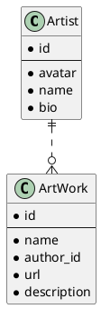

# Artshow

A single-page web app. Technology stack:

- FrontEnd
  - html/js/css
  - Boostrap
- Backend
  - Nodejs + Express
  - API doc generator: swagger-autogen

## Server Side

### Entity



There are two entities: Artist and Artwork, the relationship is one-to-many, A artist may have many artwork.

### Package

See [package.json](./package.json)

Run command below to install packages

```
npm install -y
```

## Build & Run

### Pretest with eslint

```
npm run pretest
```

### Unit test

```
npm run test
```

### Generate document

The Restful API document generated by `swagger-auto` and rendered by `swagger-express`.

Use `swagger-gen` to generate API document from `routes.js`, the command will produce `swagger-output.json` :

```
npm run swagger-gen
```

output as below, with the server running.

```txt
> server@1.0.0 swagger-gen
> node swagger.js

Swagger-autogen:  Success  
app listening on port 3000
```

- visit <http://127.0.0.1:3000/doc> to view the API document


- visit <http://127.0.0.1:3000> to see the webpage


## Run server

Run server without generate doc

```
npm run start
```
